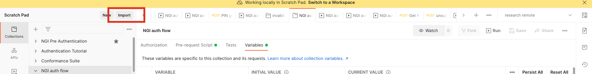
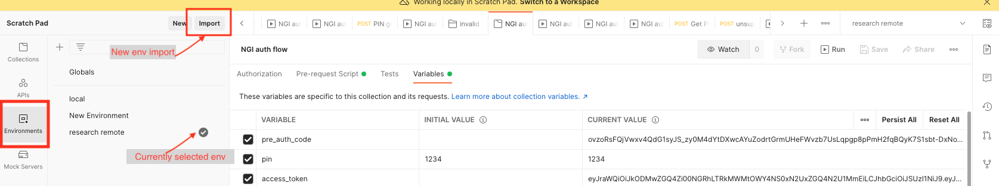
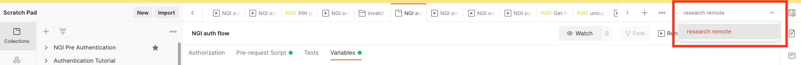
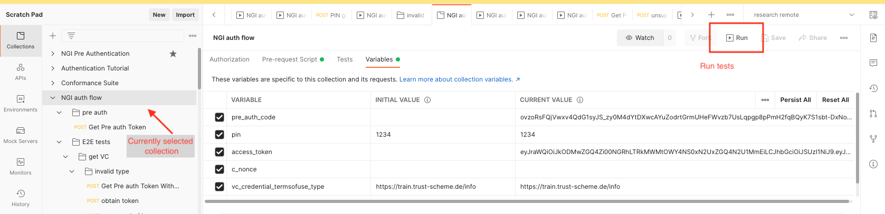

# How to run tests manually

This document describes how to run issuer tests by hand.

## Prerequisites

Before getting started, you must ensure that you have the appropriate software installed locally. Installation of these items is beyond the scope of this document, but instructions can be found for your operating system at the links provided:

* Download and install [Postman](https://www.postman.com/).

## Import required resources to postman

Following elements need to be imported to Postman before run tests.

* collection with test cases
    Import **NG-auth-flow.postman_collection.json** file to Postman collections
    
* global environment variables
    Import **ngi.postman_globals.json** global variables (it contain external library - pmlib_code - to sign/verify JWT as one of variable)
* remote environment variables
    Import **research remote.postman_environment.json** remote environment variables. It contain properties which point to *research* environment
    
## Run test manually

Before run tests make sure that proper environment variables set is selected.

Run test for *NGI auth flow* collection.
 
